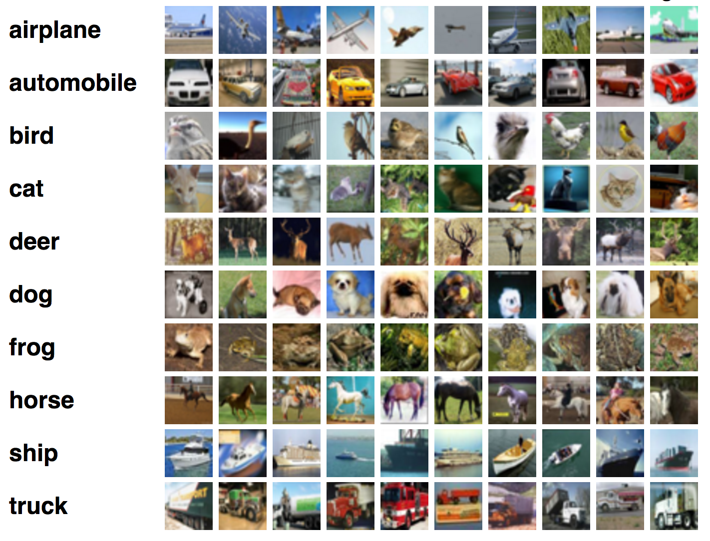
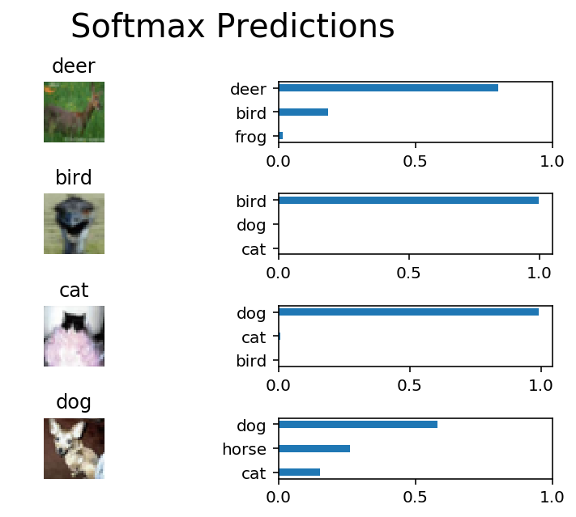

# My Second Project in Machine Learning Engineering Nanodegree
# Deep Learning
## Project: Image Classification

<p align = 'center'></p>

----

### Table Of Contents:
- [Description](#description)<br>
    - [About the project](#about-the-project)<br>
    - [What needs to be done](#what-needs-to-be-done)<br>
- [Data](#data)<br>
    - [Files](#files)<br>
    - [Dataset file](#dataset-file)<br>
- [Loading Project](#loading-project)<br>
    - [Requirements](#requirements)<br>
    - [Execution](#execution)<br>
- [Conclusion](#conclusion)<br>
    - [Evaluation](#evaluation)<br>
    - [Results](#results)

---

### Description

#### About the project
Classifying Images from [CIFAR-10 dataset](https://www.cs.toronto.edu/~kriz/cifar.html) which consists of 60000 32x32 color images in 10 classes, with 6000 images per class. There are 50000 training images and 10000 test images.
The dataset is divided into five training batches and one test batch, each with 10000 images. The test batch contains exactly 1000 randomly-selected images from each class. The training batches contain the remaining images in random order, but some training batches may contain more images from one class than another. Between them, the training batches contain exactly 5000 images from each class. 

#### What needs to be done
The dataset will need to be preprocessed, then train a convolutional neural network on all the samples. Then I'll normalize the images, one-hot encode the labels, build a convolutional layer, max pool layer, and fully connect the layer. At then end, I'll see their predictions on the sample images.

-----

### Data

#### Files

This project contains 3 files and 1 folder:

- `image_classification.ipynb`: This is the main file where I have performed my work on the project.
- `problem_unittests.py`: Helper File.
- `helper.py`: Helper File.
- `export/` : Folder containing HTML version file of notebook.

Template code is provided in the `image_classification.ipynb` notebook file. While some code has already been implemented to get me started, I will need to implement additional functionality when requested to successfully complete the project.

#### Dataset file

The dataset I have used is provided by [CIFAR-10 dataset](https://www.cs.toronto.edu/~kriz/cifar.html).

----

### Loading Project

#### Requirements

This project requires **Python 3.6** and the following Python libraries installed:

- [Python 3.6.5](https://www.python.org/downloads/release/python-365/)
- [NumPy](http://www.numpy.org/)
- [TensorFlow](https://www.tensorflow.org/install/)

You will also need to have software installed to run and execute a [Jupyter Notebook](http://jupyter.org/install)

If you do not have Python installed yet, it is highly recommended that you install the [Anaconda](https://www.anaconda.com/download/) distribution of Python, which already has the above packages and more included. 

#### Execution

In a terminal or command window, navigate to the top-level project directory `Image_Classification/` (that contains this README) and run one of the following commands:

```bash
ipython notebook image_classification.ipynb
```  
or
```bash
jupyter notebook image_classification.ipynb
```

This will open the Jupyter/iPython Notebook software and project file in your browser.

-----

### Conclusion

#### Evaluation
My project was reviewed by a Udacity reviewer against the **<a href="https://review.udacity.com/#!/rubrics/723/view" target="_blank">Image Classification project rubric</a>**. All criteria found in the rubric must be *meeting specifications* for me to pass.

#### Results

<p align = 'center'></p><br>

[My Project Review by an Udacity Reviewer](https://review.udacity.com/#!/reviews/1406431)